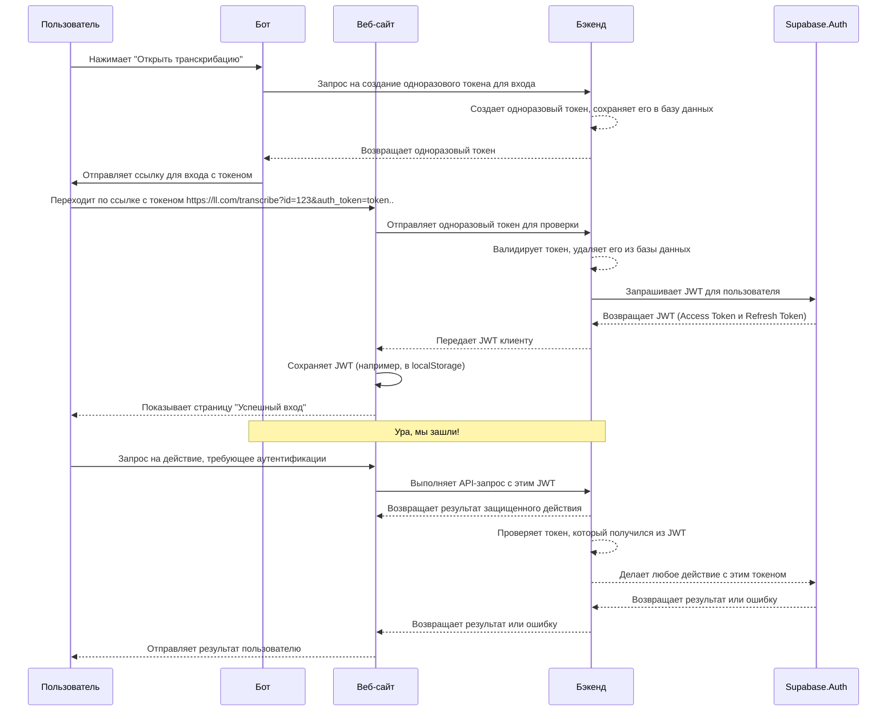

```mermaid
sequenceDiagram
    participant Пользователь
    participant Бот
    participant Веб-сайт
    participant Бэкенд
    participant Supabase.Auth

    Пользователь->>Бот: Нажимает "Открыть транскрибацию"
    Бот->>Бэкенд: Запрос на создание одноразового токена для входа
    Бэкенд-->>Бэкенд: Создает одноразовый токен, сохраняет его в базу данных
    Бэкенд-->>Бот: Возвращает одноразовый токен
    Бот->>Пользователь: Отправляет ссылку для входа с токеном

    Пользователь->>Веб-сайт: Переходит по ссылке с токеном https://ll.com/transcribe?id=123&auth_token=token..
    Веб-сайт->>Бэкенд: Отправляет одноразовый токен для проверки
    Бэкенд-->>Бэкенд: Валидирует токен, удаляет его из базы данных
    Бэкенд->>Supabase.Auth: Запрашивает JWT для пользователя
    Supabase.Auth-->>Бэкенд: Возвращает JWT (Access Token и Refresh Token)
    Бэкенд-->>Веб-сайт: Передает JWT клиенту
    Веб-сайт->>Веб-сайт: Сохраняет JWT (например, в localStorage)
    Веб-сайт-->>Пользователь: Показывает страницу "Успешный вход"

    note over Бэкенд, Бот: Ура, мы зашли!

    Пользователь->>Веб-сайт: Запрос на действие, требующее аутентификации
    Веб-сайт->>Бэкенд: Выполняет API-запрос с этим JWT
    Бэкенд-->>Веб-сайт: Возвращает результат защищенного действия
    Бэкенд-->>Бэкенд: Проверяет токен, который получился из JWT
    Бэкенд-->>Supabase.Auth: Делает любое действие с этим токеном
    Supabase.Auth-->>Бэкенд: Возвращает результат или ошибку
    Бэкенд-->>Веб-сайт: Возвращает результат или ошибку
    Веб-сайт-->>Пользователь: Отправляет результат пользователю
```