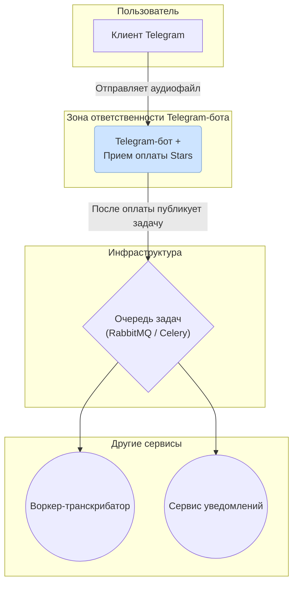

# План разработки Telegram-бота для LaterListener

## Концепция
Telegram-бот выполняет **единственную ключевую функцию**: он является точкой входа для пользователей. Его зона ответственности строго ограничена:
- Принять аудиофайл от пользователя.
- Отправить задачу с информацией о файле и пользователе в очередь.
- Сообщить пользователю, что файл принят в работу.

Вся остальная логика — транскрибация, уведомление о готовности, хранение результатов — реализуется в других сервисах, которые слушают эту очередь.

---

## 1. Этап: Проектирование и подготовка (Design & Preparation)

### 1.1. Анализ и выбор технологий
- [ ] 1.1.1. Исследовать и сравнить библиотеки для создания Telegram-ботов на Python (например, `aiogram`, `python-telegram-bot`).
- [ ] 1.1.2. Исследовать и сравнить брокеры сообщений для интеграции с очередью (например, `Celery`, `RabbitMQ`).

### 1.2. Настройка окружения и доступов
- [ ] 1.2.1. Создать нового бота в Telegram через **@BotFather**.
- [ ] 1.2.2. Сохранить токен бота в безопасном месте (переменные окружения).
- [ ] 1.2.3. Создать файл `.env.example` со всеми необходимыми переменными окружения (`TELEGRAM_BOT_TOKEN`, и т.д.).
- [ ] 1.2.4. Заполнить локальный `.env` файл актуальными данными.

### 1.3. Проектирование архитектуры
- [ ] 1.3.1. Разработать детальную схему User Flow для бота (Design):
    - Пользователь отправляет команду `/start`.
    - Пользователь отправляет аудиофайл (voice или audio).
    - Бот отвечает сообщением о том, что файл принят.
- [ ] 1.3.2. Спроектировать структуру задачи (task payload) для отправки в очередь. Обязательные поля: `user_id`, `file_id`, `file_name`, `mime_type`, `timestamp`.
- [ ] 1.3.3. Определить очередь, в которую бот будет публиковать задачи.

## 2. Этап: Базовая разработка (Core Development)

### 2.1. Инициализация проекта и базовые команды
- [ ] 2.1.1. Настроить структуру проекта.
- [ ] 2.1.2. Установить выбранную библиотеку для Telegram и настроить базовый объект бота.
- [ ] 2.1.3. Реализовать хендлер для команды `/start` (приветственное сообщение).
- [ ] 2.1.4. Реализовать хендлер для команды `/help` (краткая инструкция, как отправить файл).

### 2.2. Обработка аудиофайлов
- [ ] 2.2.1. Реализовать хендлер для приема сообщений с `voice` и `audio`.
- [ ] 2.2.2. Добавить логику валидации файла (например, проверка длительности и наличие аудио-дорожки в файле).
- [ ] 2.2.3. Получить `file_id` и другие метаданные файла от Telegram. **Бот не скачивает файл**, он только передает `file_id` в очередь.

### 2.3. Настройка клиента для очереди
- [ ] 2.3.1. Установить клиентскую библиотеку для работы с выбранным брокером сообщений (например, `celery`).
- [ ] 2.3.2. Настроить подключение к брокеру.
- [ ] 2.3.3. Создать тестовую функцию для отправки сообщения в очередь и проверить, что оно там появляется.

## 3. Этап: Реализация основной логики (Core Logic)

### 3.1. Постановка задачи в очередь
- [ ] 3.1.1. В хендлере аудиосообщений, после успешной валидации, сформировать payload задачи.
- [ ] 3.1.2. Вызвать функцию для отправки задачи в очередь.
- [ ] 3.1.3. Отправить пользователю подтверждающее сообщение (например, "Ваш файл получен и поставлен в очередь на обработку. Ожидайте следующего сообщения от нашего сервиса.").

## 4. Этап: Качество и надежность (Quality & Reliability)

### 4.1. Логирование и обработка ошибок
- [ ] 4.1.1. Настроить модуль `logging` для записи ключевых действий и ошибок.
- [ ] 4.1.2. Добавить логирование: получение файла, отправка в очередь (успешная/неуспешная).
- [ ] 4.1.3. Реализовать обработку ошибок:
    - Что делать, если очередь недоступна? (Например, уведомить пользователя о временных трудностях).
    - Что делать, если файл не прошел валидацию? (Уведомить пользователя о причине).

### 4.2. Тестирование
- [ ] 4.2.1. Выбрать и настроить фреймворк для тестирования (например, `pytest`).
- [ ] 4.2.2. Написать юнит-тесты для сервисных функций (валидация, формирование payload).
- [ ] 4.2.3. Написать интеграционные тесты для проверки отправки сообщения в очередь (с использованием mock-объекта брокера).

## 5. Этап: Деплой и поддержка (Deployment & Maintenance)

### 5.1. Подготовка к деплою
- [ ] 5.1.1. Написать `Dockerfile` для production-сборки приложения бота.
- [ ] 5.1.2. Дополнить `docker-compose.yml` для production-окружения.
- [ ] 5.1.3. Настроить CI/CD пайплайн (например, GitHub Actions) для автоматической сборки и тестирования.

### 5.2. Документация
- [ ] 5.2.1. Написать `README.md` с инструкцией по локальному запуску бота.
- [ ] 5.2.2. Задокументировать все переменные окружения в `.env.example`.
- [ ] 5.2.3. Описать формат payload, который бот отправляет в очередь. Это ключевой контракт для других сервисов.

---

## Взаимосвязи Telegram-бота с другими модулями

*   **Пользователь ↔ Бот**: Пользователь отправляет аудиофайл. Бот, в свою очередь, запрашивает и обрабатывает оплату через **Telegram Stars**.
*   **Бот → Очередь сообщений (Message Broker)**: После успешной оплаты бот формирует задачу (payload) и отправляет её в брокер сообщений. Это его единственное исходящее системное взаимодействие.
*   **Очередь сообщений → Другие сервисы**: Другие модули (воркер-транскрибатор, сервис уведомлений) подписаны на эту очередь, забирают из неё задачи и выполняют всю дальнейшую работу. Бот об их существовании не знает.

Такая архитектура делает бота простым, но функциональным шлюзом, оставляя сложную логику другим частям системы.



---

## Диаграмма последовательности (Sequence Diagram)

Представлена в файле ```bot/sequence_diagram_bot.md```
