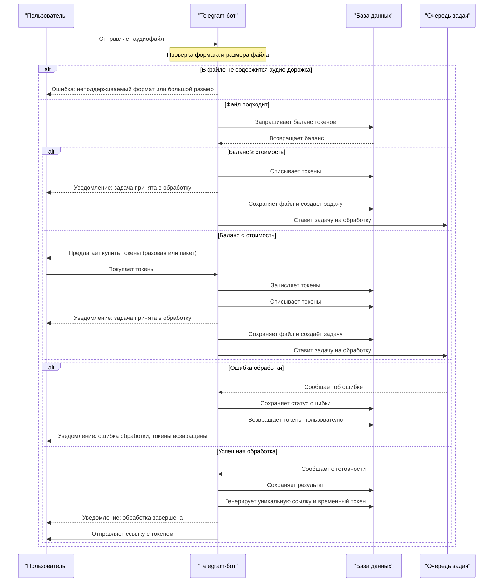

# Sequence-диаграмма работы Telegram-бота LaterListener

## Описание сценариев работы бота

### Сценарий 1: Успешная обработка с достаточным балансом токенов
1. Пользователь отправляет аудиофайл в Telegram-бота
2. Бот проверяет корректность формата и размера файла
3. Бот запрашивает баланс токенов пользователя в базе данных
4. Если баланса достаточно для обработки:
   - Бот списывает токены с баланса пользователя
   - Уведомляет пользователя о принятии задачи
   - Сохраняет файл и создаёт задачу в БД
   - Ставит задачу в очередь на обработку
5. Очередь задач обрабатывает файл (этот процесс невидим для бота)
6. После завершения обработки очередь сообщает боту о готовности
7. Бот получает сгенерированную ссылку на сайт с расшифровкой и отправляет пользователю

### Сценарий 2: Успешная обработка с недостаточным балансом токенов
1. Пользователь отправляет аудиофайл в Telegram-бота
2. Бот проверяет корректность формата и размера файла
3. Бот запрашивает баланс токенов пользователя в базе данных
4. Если баланса недостаточно для обработки:
   - Бот предлагает пользователю купить токены (разовая покупка или пакет)
   - Пользователь выполняет оплату внутри бота
   - Бот зачисляет токены на баланс пользователя
   - Бот списывает нужное количество токенов
   - Уведомляет пользователя о принятии задачи
   - Сохраняет файл и создаёт задачу в БД
   - Ставит задачу в очередь на обработку
5. Очередь задач обрабатывает файл (этот процесс невидим для бота)
6. После завершения обработки очередь сообщает боту о готовности
7. Бот получает сгенерированную ссылку на сайт с расшифровкой и отправляет пользователю

### Сценарий 3: Ошибка при обработке
1. Пользователь отправляет аудиофайл в Telegram-бота
2. Бот проверяет корректность формата и размера файла
3. Бот запрашивает баланс токенов пользователя и списывает необходимое количество
4. Бот сохраняет файл и создаёт задачу в БД
5. Бот ставит задачу в очередь на обработку
6. Очередь задач обрабатывает файл (этот процесс невидим для бота)
7. В процессе обработки возникает ошибка, очередь сообщает об этом боту
8. Бот сохраняет статус ошибки в БД
9. Бот возвращает списанные токены на баланс пользователя
10. Бот отправляет пользователю уведомление об ошибке и возврате токенов

### Сценарий 4: Некорректный файл
1. Пользователь отправляет файл в Telegram-бота
2. Бот проверяет формат и размер файла
3. Если файл не содержит аудио-дорожки или имеет неподдерживаемый формат:
   - Бот сразу отправляет пользователю сообщение об ошибке
   - Токены не списываются
   - Задача не создаётся

---

